<h1 align="center">Subagents</h1>

<p align="center">
  <strong>Turn any AI coding agent into your subagent.</strong><br/>
  Wrap kimi, claude, codex, pi, opencode, qwen, kiro, gemini — or any CLI agent — as a reusable subagent,<br/>
  then <strong>orchestrate them with dynamic workflows</strong>: pipelines, parallel swarms, and nested graphs.
</p>

<p align="center">
  <a href="https://github.com/vlln/subagents-skill/stargazers"></a>
  
  
  
  
</p>

<p align="center">
  <sub><a href="README.md">English</a> · <a href="docs/readme/README.zh-CN.md">中文</a></sub>
</p>

---

## Installation

### [skit](https://github.com/vlln/skit) (Recommended)

```bash
skit install https://github.com/vlln/subagents-skill/tree/main/skills/subagents
skit install https://github.com/vlln/subagents-skill/tree/main/skills/workflow
```

### Manually

| Agent | Command |
|-------|---------|
| **Claude Code** | `cp -r skills/subagents .claude/skills/ && cp -r skills/workflow .claude/skills/` |
| **Codex** | `cp -r skills/subagents ~/.codex/skills/ && cp -r skills/workflow ~/.codex/skills/` |
| **OpenCode** | `git clone https://github.com/vlln/subagents-skill.git ~/.opencode/skills/subagents-skills` |
| **Kimi** | `cp -r skills/subagents ~/.kimi/skills/ && cp -r skills/workflow ~/.kimi/skills/` |

---

## Skills

| Skill | Description |
|-------|-------------|
| [subagents](skills/subagents/SKILL.md) | Dispatch tasks to named agent sessions across multiple backends. Session resume, parallel swarms, JSONL output. |
| [workflow](skills/workflow/SKILL.md) | Multi-agent orchestration — pipeline, parallel, and phase-based workflows. Nested sub-workflows, resume, structured output. |

## Requirements

- Python 3.10+

## Supported Backends

<p align="center">
  <a href="https://www.kimi.com/code"><kbd> Kimi</kbd></a> &nbsp;
  <a href="https://claude.com/product/claude-code"><kbd> Claude Code</kbd></a> &nbsp;
  <a href="https://openai.com/codex/"><kbd> Codex</kbd></a> &nbsp;
  <a href="https://pi.dev/"><kbd> Pi</kbd></a> &nbsp;
  <a href="https://opencode.ai/"><kbd> OpenCode</kbd></a> &nbsp;
  <a href="https://qwen.ai/qwencode"><kbd> Qwen Code</kbd></a> &nbsp;
  <a href="https://kiro.dev/"><kbd> Kiro</kbd></a> &nbsp;
  <a href="https://geminicli.com/"><kbd> Gemini CLI</kbd></a>
</p>

<p align="center">
  <sub>Backend and transport are auto-detected. Override with <code>--backend &lt;name&gt;</code> and <code>--transport cli|acp</code>.</sub>
</p>

| Backend | Command | Transports | System Prompt |
|---------|---------|-----------|---------------|
| kimi | `kimi` | CLI, ACP | inline |
| claude | `claude` | CLI | native (append + overwrite) |
| codex | `codex` | CLI | inline |
| pi | `pi` | CLI | native (append + overwrite) |
| opencode | `opencode` | CLI, ACP | inline |
| qwen | `qwen` | CLI, ACP | native (append + overwrite) |
| kiro | `kiro-cli` | CLI, ACP | inline |
| gemini | `gemini` | CLI, ACP | inline |

These skills follow the [Agent Skills specification](https://agentskills.io/specification) — compatible with any skills-compatible agent, including Claude Code, Codex, and Open Code.

## Features

<table>
<tr>
<td width="50%" valign="top">

### 🔗 Dynamic Workflow Orchestration

Pipeline, parallel, and nested workflows with `workflow.py`. Chain agents, split-merge, resume failed stages — compose complex multi-agent topologies declaratively.

<p align="center">
  
</p>

</td>
<td width="50%" valign="top">

### 🧩 Any Agent CLI as Subagent

Wrap any CLI agent as a reusable subagent. Auto-detection picks the right backend; override with `--backend`. Extensible — add new backends in a few lines.

<p align="center">
  
</p>

</td>
</tr>
<tr>
<td width="50%" valign="top">

### 🔁 Persistent Sessions

Every run creates a named session. Resume it later and the agent remembers all prior context. Build up multi-turn conversations over days.

</td>
<td width="50%" valign="top">

### ⚡ Parallel Swarms

Fan out tasks across multiple agents with `--bg`, then `subagents wait` to collect results. Run 10 reviewers against 10 files simultaneously.

</td>
</tr>
<tr>
<td width="50%" valign="top">

### 📡 JSONL Output

`--output json` for structured, streamable, versioned JSONL. Every event typed and timestamped — ready for piping into other tools.

</td>
<td width="50%" valign="top">

### 🪶 Zero Dependencies

Python 3.10+ standard library only. No `pip install`, no `virtualenv`. Drop the scripts in and run.

</td>
</tr>
</table>

## Quick Start

```bash
# Define an agent (optional)
mkdir -p .agents/subagents
cat > .agents/subagents/reviewer.md << 'EOF'
---
name: reviewer
description: Expert code reviewer
---
You are a code reviewer. Analyze code for correctness, security, and best practices.
EOF

# Run a task
scripts/subagents run reviewer review-auth "Review src/auth.ts for security issues"

# Resume the session with more context
scripts/subagents run reviewer review-auth "Now check the error handling"

# Run 3 reviewers in parallel
scripts/subagents run --bg reviewer r1 "Review src/auth.ts"
scripts/subagents run --bg reviewer r2 "Review src/db.ts"
scripts/subagents run --bg reviewer r3 "Review src/api.ts"
scripts/subagents wait r1 && scripts/subagents wait r2 && scripts/subagents wait r3

# List all agents and sessions
scripts/subagents list
```

## Demo

Record animated terminal demos with [console2svg](https://github.com/arika0093/console2svg):

```bash
# Install
npm install -g console2svg

# Record subagents demo (queue, cwd, send, cancel, status)
console2svg "bash demos/subagents-demo.sh" \
    -o docs/subagents.svg -w 100 -h 40 \
    -d macos --theme dark -v --fps 12 --timeout 25

# Record workflow demo (TTY tree, phases, spinners, live updates)
console2svg "bash demos/workflow-demo.sh" \
    -o docs/workflow.svg -w 100 -h 36 \
    -d macos --theme dark -v --fps 12 --timeout 15
```

## Development

```bash
# Unit tests (no backend required, CI-safe)
python3 -m pytest tests/ --ignore=tests/test_integration.py

# Integration tests (requires kimi CLI)
SKIP_INTEGRATION=0 python3 -m pytest tests/test_integration.py -v

# All tests
SKIP_INTEGRATION=0 python3 -m pytest tests/ -v
```

| Layer | File | Count | Trigger | Time |
|-------|------|-------|---------|------|
| Unit | `tests/test_subagents.py` | 79 | `pytest` auto | <1s |
| Unit | `tests/test_workflow.py` | 26 | `pytest` auto | <1s |
| Integration | `tests/test_integration.py` | 8 | `SKIP_INTEGRATION=0` | ~3min |

## License

MIT